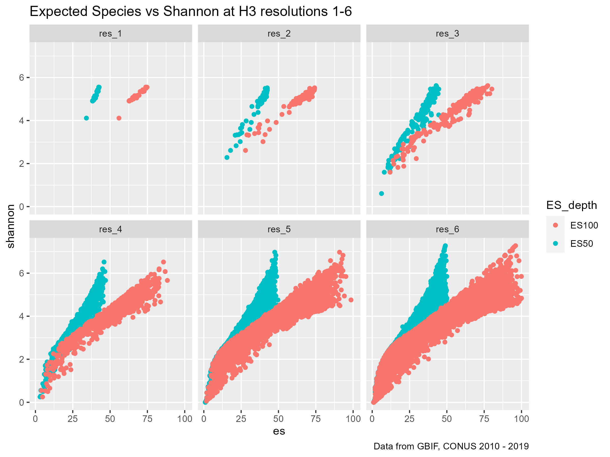

```{css, echo=FALSE}
pre {
  max-height: 300px;
  overflow-y: auto;
}

pre[class] {
  max-height: 200px;
}
```

```{r, include = FALSE}
knitr::opts_chunk$set(
  collapse = TRUE,
  comment  = "#>",
  warning  = FALSE, 
  message  = FALSE,
  out.width = "90%")
```

```{r setup}
library(obisindicators)
library(dplyr)
```

## What are we doing? 

OBIS is small enough to analyse by itself on a decent laptop computer or a small cluster. We have previously visualized ES50 for OBIS data by decade.


But adding GBIF has an order of magnitude more records than OBIS, so combining the two takes it to another level.  Options for tackling this volume of data include increasing the memory in your cluster or splitting up the analysis into more manageable chunks.  Here we demonstrate the latter.

## Summarizing Exploratory Analysis

I had to make the analysis work on one of three resources:

1. My government laptop:
   - Has 12th Gen Intel(R) Core(TM) i7-1265U   1.80 GHz with 32 GB of RAM
   
2. The USGS HPC Denali
   - A single node has Two 20-core 2.4 Ghz Intel Xeon Gold 6148 processors (Skylake) with 192 GB RAM (4.8 GB/core)
   
3. An AWS cloud instance with 8 cpu and 32 GB of RAM

### arrow, dask and spark are not enough

The data are ~ 185 GB, representing 2.4 billion records and XX columns.  The parquet file format helps, but generally chokes when trying to calculate the diversity metrics because:

1. The biodiversity indices are not simple summary statistics, like mean.
1. The data needs to be grouped by h3 cells. At high resolutions, this means there are millions of cells, and the parquet file is not partitioned by h3 cell.  This means you either need a large amount of memory to hold the entire dataset while you compute the indices, or you need to repartition the data after indexing by cell, so that the indices can be calculated in subsets of cells.

As the [dask documentation](https://docs.dask.org/en/stable/best-practices.html) points out, sometimes you need to chunk up your data. I tried using `dask` and `spark` in addition to R `arrow` but stopped putting effort into those methods because I was less comfortable with python and java then R and it became apparent that no matter what I would have to process the data in chunks to compute the global data set on the resources I had access to. The R package `sparklyr` required installation of a Spark environment, something I couldn't do without IT intervention, so I didn't pursue it. Similarly, while it was easy to spin up a dask cluster on AWS, I couldn't easily do that on our HPC, so I didn't put effort into pursuing it. But going forward, both options could probably accomplish the same thing as this R work flow.

### binned values are easier to interpret than continuous

We created maps with both continuous color schemes and with binned color schemes.  We found that in the former it was difficult to differentiate the middle values.  Our conclusion was that precise values were not as useful as being able to quickly understand where biodiversity was extremely low, high, and what the approximate "normal" was for various regions.

|Continuous Color | Discrete Color |
|----|----|
|||


### Hurlbert Index (ESi) vs Traditional Biodiversity metrics

See [my explanation of ESi](./ES50_explained.Rmd) for background on the metric.

We examined the relationship between ESi, Richness, Shannon Diversity, and Hill Number of 1.  Ultimately, it was clear that there was a strong correlation between Shannon Diversity and ESi for this set of data. In the image below, the panels represent different h3 resolutions.  There didn't seem to be a strong influence of resolution on the relationship, or either metric. 



This is probably because:

1. We aren't yet accounting for abundance beyond each occurrence record (e.g. individualCount or organismQuantity)
1. There are some strong sampling biases in the GBIF and OBIS data.  This is explained a bit in [John Waller's blog post](https://data-blog.gbif.org/post/exploring-es50-for-gbif/#es50-fail-cases).

However, I think it's arguable that the output of ESi is more intuitive to humans than Shannon Diversity while avoiding the extreme effects of sampling bias that are associated with richness.

### ES50 vs ES100

We weren't sure what the best sampling depth was for ESi for these global datasets.  We wanted to achieve something that could resolve real differences in diversity, while discarding as few cells as possible for lack of data.  Some past studies had looked at ES50 and ES100, so we did the same. We found that ES100 worked really well for areas like the United States where there is an abundance data.  ES50 didn't provide as much nuance, but was able to provide values for more cells.

After quality filtering (we still haven't addressed "issue" flags), we had data in 533564 of 2016842 cells, or about 1/4 of the cells on the globe.  Of these, we could calculate a non-NA value for about 30% of them when using ES50 (so about 8% of the total cells on the globe) vs 23% with ES100 (about 6% of the total cells on the globe).  

### Using the h3 grid: pros and cons

We struggled with consistently implementing the dggridR system.  We had too many collaborators struggle with installation to make it seem like a good system with regard to reproduciblity. The [h3 system](https://www.uber.com/blog/h3/) is a nice grid solution for a variety of reasons, and we were intrigued by the nesting properties, which have proven to be useful for exploring this data and our analysis directions.

However, hexagons are more computationally costly than rectangles and represent a hurdle in generating an sharing the data. Furthermore, the hexagons in the h3 system vary in area relative to the icosahedron vertices, so they are not as statistically rigorous as the dggridr system.

#### resolution with regard to ESi

If we use a coarser resolution, than we can reduce the number of NA values with ESi.  This is very pleasing to look at, but paints some polities in too broad of strokes in addition to giving the illusion that our data covers the earth much more completely that is true. For example, at a resolution of 3, 20% of the [countries in the world](https://en.wikipedia.org/wiki/List_of_countries_and_dependencies_by_area) are represented by ~ 1 hexagon, or less. We chose to work with a h3 resolution of 5. This resolution means each hexagon is ~ 253 km^2, [on average](https://h3geo.org/docs/core-library/restable/#average-area-in-km2). We chose this after examining some sample data at resolutions 2 - 7.  We felt a resolution of 5 balanced our desire to show hi-resolution diversity metrics without discarding too much data that was too sparse to meet the requirments of the Hurlbert (AKA ES) index). For perspective, at this resolution, the Great Barrier Reef contains about 1375 hexagons and the island country of Barbados would be covered by about 2 hexagons.    

### Strategy for analysis

We're going to visualize our biodiversity values as h3 hexagons and by decade, since these are two useful units for aggregating the data into a meaningful amount of time and space.  So our strategy will be to:

1. Remove data that isn't needed.
1. Index each occurrence record to an h3 cell.
1. Divide the earth into four quadrants and index the h3 cell centroids to those quadrants.
1. Write new parquet files, re-partitioned by year and quadrant. These parquet files are our new starting point.
1. Next we will:
   1. read in the parquet files
   1. join the OBIS and GBIF data
   1. calculate the diversity indices for each cell by decade
   1. join with the h3 grid and visualize.

### Download OBIS and GBIF snapshots as parquet files

It is much faster to work with these large parquet files locally than calling an S3 bucket via `arrow` or another package.  Every month, GBIF publishes a snapshot of their database via [AWS](https://registry.opendata.aws/gbif/).  The OBIS snapshot is published every **XXXX** and can be found at https://obis.org/data/access/#

Download these parquet files to your local machine as the raw data for this analysis.

### Remove data that isn't needed.

In addition to removing undeeded columns, we'll only work with the most recent decade of data for this vignette.  A few caveats about the code:

1. We're doing some filtering based on recommendations from other GBIF/OBIS users (linked below). That being said, I haven't yet dealt with the "issues" column, as recommended, because the array format was difficult to deal with before the "collect" function.  Eventually, issues will be filtered out too.

   1. [Data Use Club](https://www.gbif.org/event/2CAcHI4oxVK5ZgMnFszNUD/data-use-club-practical-sessions-data-quality)
   1. [Mark Costello Blog Post](https://www.oceansofbiodiversity.auckland.ac.nz/2018/09/29/tips-when-selecting-biodiversity-data-from-gbif-and-obis/)
1. As fantastic as the R `arrow` package is, it doesn't have the full dplyr function implemented yet. For example `%in%` and `!=` aren't implemented yet in filter arrow. So you'll see a few places where the code is more verbose than it typically needs to be for filtering the data.

#### Process OBIS first

```{r download obis and gbif, eval=FALSE}

library(dplyr)
library(arrow)

setwd("/caldera/projects/css/sas/bio/spec_obs/global_biodiversity_map/")

#generate h3 indices by hemisphere
source("src/R/HPC/h3_index_by_hemisphere.R")

#Reduce parquet to columns that are needed for analysis
df <- open_dataset(sources = "data/raw/obis/snapshot/obis_20221006.parquet")

#select columns
desired_cols <- c("id",
                  "decimalLongitude",
                  "decimalLatitude",
                  "eventDate",
                  "date_year",
                  "countryCode",
                  "basisOfRecord",
                  "occurrenceStatus",
                  "flags",
                  "dropped",
                  "kingdom",
                  "class",
                  "species")

occ <- df %>% 
  select(all_of(desired_cols)) %>% 
  filter(date_year >= 2010) %>%
  filter(date_year <= 2019) %>%
  filter(occurrenceStatus == "Present" | occurrenceStatus == "present") %>% 
  filter(basisOfRecord == "Observation" |
           basisOfRecord == "MachineObservation" |
           basisOfRecord == "HumanObservation" |
           basisOfRecord == "MaterialSample" |
           basisOfRecord == "PreservedSpecimen" |
           basisOfRecord == "Occurrence") %>%
  filter(!is.na(species)) %>%
  filter(!is.na(decimalLatitude)) %>%
  select(-basisOfRecord,
         -occurrenceStatus,
         -countryCode) %>%
  collect()


#rename some columns to Match GBIF/Darwin Core convention
occ <- occ %>% 
  rename(obisid = id,
         decimallongitude = decimalLongitude,
         decimallatitude = decimalLatitude,
         year = date_year,
         eventdate = eventDate)
```

Now we need to make the h3 and qudrant indices so we can apply them to our occurrence records.

```{r make and apply spatial indices, eval=FALSE}

#Index h3 cells to earth quadrants.  h3 can't polyfill beyond 180 degree arcs, which makes it a little verbose.

CRS <- sf::st_crs(4326)

NW1 <- sf::st_sf(geom = sf::st_as_sfc(sf::st_bbox(c(
  xmin = 0,
  xmax = -90,
  ymin = 0,
  ymax = 90
), crs = CRS)))

NW2 <- sf::st_sf(geom = sf::st_as_sfc(sf::st_bbox(
  c(
    xmin = -90,
    xmax = -180,
    ymin = 0,
    ymax = 90
  ), crs = CRS
)))

NE1 <- sf::st_sf(geom = sf::st_as_sfc(sf::st_bbox(c(
  xmin = 0,
  xmax = 90,
  ymin = 0,
  ymax = 90
), crs = CRS)))

NE2 <- sf::st_sf(geom = sf::st_as_sfc(sf::st_bbox(
  c(
    xmin = 90,
    xmax = 180,
    ymin = 0,
    ymax = 90
  ), crs = CRS
)))

SW1 <- sf::st_sf(geom = sf::st_as_sfc(sf::st_bbox(
  c(
    xmin = 0,
    xmax = -90,
    ymin = 0,
    ymax = -90
  ), crs = CRS
)))

SW2 <- sf::st_sf(geom = sf::st_as_sfc(sf::st_bbox(
  c(
    xmin = -90,
    xmax = -180,
    ymin = 0,
    ymax = -90
  ), crs = CRS
)))

SE1 <- sf::st_sf(geom = sf::st_as_sfc(sf::st_bbox(c(
  xmin = 0,
  xmax = 90,
  ymin = 0,
  ymax = -90
), crs = CRS)))

SE2 <- sf::st_sf(geom = sf::st_as_sfc(sf::st_bbox(
  c(
    xmin = 90,
    xmax = 180,
    ymin = 0,
    ymax = -90
  ), crs = CRS
)))

NW_hex_ids <- c(h3::polyfill(NW1, res = 5),
                h3::polyfill(NW2, res = 5))

NE_hex_ids <- c(h3::polyfill(NE1, res = 5),
                h3::polyfill(NE2, res = 5))

SW_hex_ids <- c(h3::polyfill(SW1, res = 5),
                h3::polyfill(SW2, res = 5))

SE_hex_ids <- c(h3::polyfill(SE1, res = 5),
                h3::polyfill(SE2, res = 5))


#Add h3 cell index and quadrant to occurrence record
occ$cell <- occ %>% 
  select(decimallatitude,
         decimallongitude) %>%
  h3::geo_to_h3(latlng = .,
                res = 5)

occ$hemisphere <- case_when(occ$cell %in% NW_hex_ids ~ "NW",
                            occ$cell %in% NE_hex_ids ~ "NE",
                            occ$cell %in% SW_hex_ids ~ "SW",
                            occ$cell %in% SE_hex_ids ~ "SE")

```

Write the object to parquet files, optimizing future analysis by partitioning by year and quadrant. 

```{r write parquet OBIS, eval = FALSE}
#write parquet files
write_dataset(dataset = occ,
              format = "parquet",
              path = "data/processed/OBIS_2010s/", 
              partitioning = c("year","hemisphere"), 
              existing_data_behavior = "overwrite")
```

#### Process GBIF

This is very similar to the OBIS cleaning above.  Mostly there are only differences in the capitalization of column names (why?)  Since we have already created quadrant indices, we don't need to do that again. One big difference is that the GBIF data is big enough that the resources we had on hand weren't sufficient to process 2010 - 2019 in one go.  So instead we loop through each partition. This took about 1-3 seconds for each of the partitions, so about 50 minutes total.

```{r clean and write GBIF, eval = FALSE}

library(dplyr)
library(arrow)

setwd("/caldera/projects/css/sas/bio/spec_obs/global_biodiversity_map/")

#list all partitions
partitions <- list.files(path = "data/raw/gbif/snapshot/2023-01-01/occurrence.parquet/", full.names = TRUE)

lapply(partitions, function(x) {
  print(x) #acts as a makeshift-progress bar
  
  occ <- arrow::open_dataset(sources = x)
  
  occ <- occ %>%
    select(
      gbifid,
      basisofrecord,
      occurrencestatus,
      countrycode,
      year,
      decimallongitude,
      decimallatitude,
      species,
      kingdom,
      class,
      eventdate
    ) %>%
    filter(year >= 2010) %>%
    filter(year <= 2019) %>%
    filter(occurrencestatus == "PRESENT") %>%
    filter(
      basisofrecord == "OBSERVATION" |
        basisofrecord == "MACHINE_OBSERVATION" |
        basisofrecord == "HUMAN_OBSERVATION" |
        basisofrecord == "MATERIAL_SAMPLE" |
        basisofrecord == "PRESERVED_SPECIMEN" |
        basisofrecord == "OCCURRENCE"
    ) %>%
    filter(!is.na(species)) %>%
    filter(!is.na(decimallatitude)) %>%
    select(-basisofrecord, -occurrencestatus, -countrycode) %>%
    collect()
  
  #Add h3 index, hemisphere and rewrite as parquet
  
  occ$cell <- occ %>%
    select(decimallatitude,
           decimallongitude) %>%
    h3::geo_to_h3(latlng = .,
                  res = 5)
  
  occ$hemisphere <- case_when(
    occ$cell %in% NW_hex_ids ~ "NW",
    occ$cell %in% NE_hex_ids ~ "NE",
    occ$cell %in% SW_hex_ids ~ "SW",
    occ$cell %in% SE_hex_ids ~ "SE"
  )
  
  
  #write to parquet
  partition_name <- basename(x)
  
  write_dataset(
    dataset = occ,
    path = paste0("data/processed/GBIF_2010s/",
                  partition_name),
    partitioning = c("year", "hemisphere"), 
    existing_data_behavior = "overwrite"
  )
  
  tictoc::toc()
  
})

```

### Calculate Diversity Indices and Join with h3 Grid

We will use a modified version of the `obisindicators` function, `obis_calc_indicators`, to calculate several indices at the same time.  Run `?obisindicators::calc_indicators` to learn more about the input and output structure.

I found that the function currently in the `obisindicators` package is a little slow. I think this is because it depends on a lot of `tidyverse` functions.  While more readable, it can be sped up by several orders of magnitude if it is rewritten in data.table like so:

```{r rewrite calc_indicators, eval = FALSE}

#obisindicators::calc_indicators() rewritten in data.table for speed
obis_calc_indicators_improved_dt <- function (df, esn = 50)
{
  stopifnot(is.data.frame(df))
  stopifnot(is.numeric(esn))
  stopifnot(all(c("cell", "species", "records") %in% names(df)))
  dt <- data.table::as.data.table(df)
  
  dt <- dt[, .(ni = sum(records)),
           by = .(cell, species)]
  
  dt[, `:=`(n = sum(ni)),
     by = cell]
  
  dt[, `:=`(
    hi = -(ni / n * log(ni / n)),
    si = (ni / n) ^ 2,
    qi = ni / n,
    esi = ifelse(
      n - ni >= esn,
      1 - exp(
        gsl::lngamma(n - ni + 1) + gsl::lngamma(n - esn + 1) - gsl::lngamma(n - ni - esn + 1) - gsl::lngamma(n + 1)
      ),
      ifelse(n >= esn,
             1,
             NA)
    )
  ),
  by = cell]
  
  dt <- dt[, .(
    n = sum(ni),
    sp = .N,
    shannon = sum(hi),
    simpson = sum(si),
    maxp = max(qi),
    es = sum(esi)
  ), by = .(cell)]
  dt[, `:=`(
    hill_1 = exp(shannon),
    hill_2 = 1 / simpson,
    hill_inf = 1 / maxp
  ),
  by = cell]
  
  return(dt)
  
}

```

#### Calculate the indices, looping through quadrants for the entire decade.

This took about 15-20 minutes for me.

```{r calculate bio idx and join with h3, eval = FALSE}

setwd("/caldera/projects/css/sas/bio/spec_obs/global_biodiversity_map/")

library(arrow)
library(dplyr)
library(sf)
library(ggplot2)

#set ES sampling depth
es_depth <- 100

#load data

obis <- open_dataset(sources = "data/processed/OBIS_2010s/")
gbif <- open_dataset(sources = "data/processed/GBIF_2010s/")

hemispheres <- c("NE", "NW", "SE", "SW") #need to investigate what to do with NA values from hemisphere

bio_idx <- lapply(hemispheres, function(x) {
  
  print(x) #makeshift progress bar
  
  obis_comp <- obis %>%
    select(#year, not needed save memory
      species,
      cell,
      hemisphere,
      kingdom) %>%
    filter(hemisphere == x) %>%
    select(-hemisphere) %>%
    filter(kingdom == kings) %>%
    collect()
  
  gbif_comp <- gbif %>%
    select(#year, not needed, save memory
      species,
      cell,
      hemisphere,
      kingdom) %>%
    filter(hemisphere == x) %>%
    select(-hemisphere) %>%
    filter(kingdom == kings) %>%
    collect()
  
  done <- list(obis_comp, gbif_comp)
  done <- data.table::rbindlist(done)
  
  done <- done[,
               .N,
               by = .(cell,
                      #year,
                      species)]
  
  done <- done %>%  rename(records = N) #accommodate obisindicators function
  
  #Calculate diversity indices
  
  bio_idx <-
    done %>% obis_calc_indicators_improved_dt(esn = es_depth) %>%
    select(cell, es) #save memory
  
  return(bio_idx)
  
}) %>%
  data.table::rbindlist()
```

### Make h3 Grid

The global h3 grid has to be generated for the resolution you did the indexing at, in our case resolution == 5.  You can read more about this [here](https://h3geo.org/docs/core-library/restable/). This resolution means each hexagon is ~ 253 km^2, on average. We chose this after examining some sample data at resolutions 2 - 7.  We felt a resolution of 5 balanced our desire to show hi-resolution diversity metrics without discarding too much data that was too sparse to meet the requirments of the Hurlbert (AKA ES) index). For perspective, at this resolution, the Great Barrier Reef contains about 1375 hexagons and the island of Barbados would be covered by about 2 hexagons.  

One important thing to keep in mind is that you only need to generate this grid once. Then you can stash it as an `rds` object for any subsequent runs.  Each increase in resolution corresponds to about an order of magnitude increase in the number of cells.  I noticed a real slowdown above 5. Using `future` and `furrr` to parallelize it helped some.

```{r make h3 grid, eval = FALSE}

make_h3_grids_parallel <- function (hex_res = 2){
  CRS <- sf::st_crs(4326)
  east <- sf::st_sf(geom = sf::st_as_sfc(sf::st_bbox(
    c(
      xmin = 0,
      xmax = 180,
      ymin = -90,
      ymax = 90
    ), crs = CRS
  )))
  west <- sf::st_sf(geom = sf::st_as_sfc(sf::st_bbox(
    c(
      xmin = -180,
      xmax = 0,
      ymin = -90,
      ymax = 90
    ), crs = CRS
  )))
  hex_ids <-
    c(h3::polyfill(east, res = hex_res),
      h3::polyfill(west,
                   res = hex_res))
  dl_offset <- 60
  
  future::plan(strategy = "multisession",
               workers = future::availableCores() * 0.75)
  
  #make sliding chunk size with res
  chunk <- dplyr::case_when(hex_res == 4 ~ 2e4,
                            hex_res == 5 ~ 5e4,
                            hex_res == 6 ~ 1e5,
                            TRUE ~ 1e4)
  n <- length(hex_ids)
  r  <- rep(1:ceiling(n / chunk), each = chunk)[1:n]
  hex_ids <- split(hex_ids, r)
  
  hex_sf <-
    furrr::future_map_dfr(hex_ids, function(x) {
      h3::h3_to_geo_boundary_sf(unlist(x))
    },
    .options = furrr::furrr_options(seed = NULL)) %>%
    sf::st_as_sf(data.table::rbindlist(.)) %>%
    sf::st_wrap_dateline(c(
      "WRAPDATELINE=YES",
      glue::glue("DATELINEOFFSET={dl_offset}")
    )) %>%
    dplyr::rename(hex_ids = h3_index)
  
  future::plan(strategy = "sequential")
  
  return(hex_sf)
}

h3_grids <- make_h3_grids_parallel(hex_res = 5)

```

### Join the biodiveristy indices with the h3 grid.

```{r join grid with indicators, eval = FALSE}

#join grid and indicators----
grid <- inner_join(h3_grids,
                   bio_idx,
                   by = c("hex_ids" = "cell"))

```

## Visualize the results. 

I used a custom function base off [something Matt Biddle wrote](https://github.com/MathewBiddle/globe/blob/main/use_parquet_file_for_globe.Rmd), and modified it with some elements from some of [John Waller's plots](https://github.com/jhnwllr/es50) so I could play with a few key parameters.

```{r make custom map function, eval = FALSE}

gmap_discrete <- function(grid,
                          column = "shannon",
                          label = "Shannon index",
                          trans = "identity",
                          crs = "+proj=robin +lon_0=0 +x_0=0 +y_0=0 +ellps=WGS84 +datum=WGS84 +units=m +no_defs",
                          limits = c(0, 8)) {
  bb_roi <-
    'POLYGON ((-180 -90, 180 -90, 180 90, -180 90, -180 -90))'
  
  sfc <-
    st_as_sfc(bb_roi, crs = '+proj=longlat +datum=WGS84 +no_defs +ellps=WGS84 +towgs84=0,0,0')
  bb <- sf::st_bbox(st_transform(sfc, crs))
  
  breaks = seq(0, max(limits), max(limits) / 5)
  
  grid[[column]] <- cut(grid[[column]], breaks = breaks)
  
  ggplot() +
    
    geom_sf(
      data = grid,
      aes_string(fill = column, geometry = "geometry"),
      show.legend = TRUE,
      lwd = 0.01
    ) +
    scale_fill_brewer(palette = "Spectral",
                      direction = -1,
                      na.value = 'skyblue1') +
    
    geom_sf(
      data = world,
      fill = NA,
      color = "grey",
      lwd = 0.1
    ) +
    
    coord_sf(crs  = crs,
             xlim = bb[c("xmin", "xmax")],
             ylim = bb[c("ymin", "ymax")]) +
    
    theme(
      panel.background = element_rect(
        fill = "white",
        colour = "gray95",
        size = 0,
        linetype = "blank"
      ),
      axis.ticks = element_blank(),
      plot.margin = margin(0, 0, 0, 0, "cm")
    )
}

```

Make the map. Generating and/or saving the map takes about 2-3 minutes because I'm making it hi-res.

```{r make map, eval = FALSE}
# map defaults
RES <- 5 # defined at https://h3geo.org/docs/core-library/restable/
column <- "es"
label <- paste0("ES", es_depth) #legend label
trans <- "identity"
crs <-
  "+proj=robin +lat_ts=0 +lat_0=0 +lon_0=0 +x_0=0 +y_0=0 +datum=WGS84 +units=m +no_defs +type=crs"
limits <- c(0, 100) #legend limits

#states
USA_shape <- rnaturalearth::ne_states(returnclass = "sf", country = "United States of America")
world <- rnaturalearth::ne_countries(scale = "small",
                              returnclass = "sf")

map <- gmap_discrete(
  grid,
  column,
  label = label,
  trans = trans,
  crs = crs,
  limits = limits
)

# ggsave(filename = paste0("output/tests/HPC/", label, "_global_2010s_res5_OBIS+GBIF_", kings, "_", Sys.Date(), ".png"),
#         plot = map,
#         width = 16000,
#         height = 8000,
#         units = "px",
#         scale = 1,
#         limitsize = FALSE)

```


